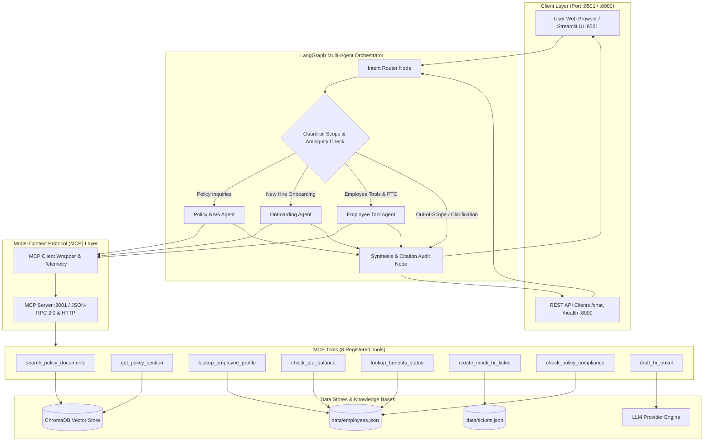

# GlobalTech HR Multi-Agent System: Design & Evaluation Documentation

This document provides a comprehensive technical overview of the **GlobalTech HR Multi-Agent Automation System**. It details the system architecture, RAG design, Model Context Protocol (MCP) server integration, LangGraph agent orchestration, tool schemas, safety guardrails, deployment architecture, and benchmark evaluation methodology, including all 25 test questions, expected answers, and experimental results.

---

## 1. System Architecture

The GlobalTech HR Multi-Agent System is an enterprise-grade agentic assistant built on **LangGraph** and the **Model Context Protocol (MCP)**. It unifies semantic retrieval over multi-format company policy documents with transactional employee workflows (such as PTO balance verification, leave request submission, onboarding roadmaps, and expense compliance auditing), while enforcing strict action-safety guardrails.

### 1.1 Architecture Topology Diagram



### 1.2 Core Architectural Components

1. **Streamlit Frontend (`app.py` & `src/app/streamlit_app.py`):**
   - Provides an interactive chat interface with live persona switching, one-click demo tasks, collapsible citation cards, and real-time operational execution traces.
   - Implements `@st.cache_resource` for database connections to prevent SQLite client recreation on reactive reruns.
2. **FastAPI REST Backend (`src/api/server.py`):**
   - Exposes `/chat` for programmatic agent invocation, returning answers, citations, and MCP telemetry.
   - Exposes `/health` reporting service status, vector store chunk count, and MCP connectivity.
3. **LangGraph StateGraph Orchestrator (`src/agents/orchestrator.py`):**
   - Coordinates cyclical and conditional agent execution through a strongly typed state schema (`HRAgentState`).
4. **Model Context Protocol Layer (`src/mcp/`):**
   - Implements 8 standardized tools exposed over JSON-RPC 2.0 and Streamable HTTP on port `8001` with client-side telemetry logging.
5. **ChromaDB Local Vector Store (`src/rag/vector_store.py`):**
   - On-disk persistent vector database storing 37 semantic chunks across 5 corporate policy documents.
6. **Unified LLM Provider Engine (`src/agents/llm_provider.py`):**
   - Uses **OpenRouter** as the primary LLM provider via `OPENROUTER_API_KEY` and configurable models (e.g., `openai/gpt-4o-mini`, `anthropic/claude-3.5-sonnet`), with a robust local deterministic synthesis fallback for zero-cost offline evaluations.


---

## 2. Retrieval-Augmented Generation (RAG) Design

### 2.1 Multi-Format Policy Corpus
The knowledge base comprises 11 comprehensive company policy documents stored in `data/policies/`, spanning Markdown (`.md`), HTML (`.html`), and Plain Text (`.txt`). The corpus totals **16,538 words** (~55.1 standard pages at 300 words/page, ~41.3 pages at 400 words/page, ~33.1 pages at 500 words/page), fitting squarely in the 30–120 page requirement:
1. `remote_work_policy.md` (`POL-REMOTE-2024`, 2,667 words, ~8.9 pages, Markdown) &rarr; Remote & hybrid work eligibility, international workation limits (30 days/yr), core hours, equipment stipend.
2. `pto_leave_policy.md` (`POL-PTO-2024`, 2,114 words, ~7.0 pages, Markdown) &rarr; Tiered PTO accrual (Tier 2 20 days), sick leave, parental/bereavement leave, 5-day rollover rules, blackout periods.
3. `benefits_health_policy.html` (`POL-BEN-2024`, 1,818 words, ~6.1 pages, HTML) &rarr; Health & welfare benefits, Premier PPO ($500/$1,000 deductible), HDHP/HSA, dental, vision, 401(k) 5% match, $600 wellness stipend.
4. `expense_travel_policy.md` (`POL-EXP-2024`, 1,622 words, ~5.4 pages, Markdown) &rarr; Travel and expense reimbursement, $125/day meal allowance caps, $25 receipt threshold, rideshare and mileage rules.
5. `code_of_conduct.txt` (`POL-ETHICS-2024`, 1,500 words, ~5.0 pages, Plain Text) &rarr; Code of business ethics, conflicts of interest, vendor gift acceptance limit ($75 USD threshold), anti-bribery.
6. `information_security_policy.md` (`POL-SEC-2024`, 1,323 words, ~4.4 pages, Markdown) &rarr; Enterprise data security, 4-tier data classification (Public, Internal, Confidential, Restricted), MFA, device encryption, incident response.
7. `onboarding_and_equipment_policy.html` (`POL-ONB-2024`, 1,211 words, ~4.0 pages, HTML) &rarr; New hire onboarding roadmap, Day 1 checklist, $750 home office equipment allowance, 30-day benefits election window.
8. `paid_holidays_and_schedules.txt` (`POL-HOL-2024`, 872 words, ~2.9 pages, Plain Text) &rarr; 11 standard company holidays, 2 floating holidays, core working hours (10:00 AM – 4:00 PM), schedule flexibility.
9. `workplace_relations_and_conduct.md` (`POL-REL-2024`, 1,283 words, ~4.3 pages, Markdown) &rarr; Workplace conduct, manager-employee relationships, consensual relationship disclosure, non-retaliation, harassment investigations.
10. `office_locations_and_facilities.html` (`POL-FAC-2024`, 918 words, ~3.1 pages, HTML) &rarr; Global office locations (San Francisco HQ, New York, London, Tokyo), badge security, visitor protocols, desk hoteling.
11. `employment_types_and_classification.txt` (`POL-EMP-2024`, 1,210 words, ~4.0 pages, Plain Text) &rarr; Employment classifications (Regular Full-Time, Part-Time, Temporary, Intern, Contractor), FLSA exempt vs non-exempt status, benefits eligibility matrix.

### 2.2 Heading-Aware Chunking Strategy
Standard fixed-token chunking often fractures logical clauses (e.g., separating an equipment dollar limit from its eligibility conditions). 

To solve this, `HeadingAwareChunker` (`src/rag/chunker.py`) uses regex-based section detection:
- **Header Patterns:** Matches Markdown `#` to `####` and numbered titles (`1. PURPOSE`).
- **Context Injection:** Prepends document and section hierarchy to each chunk:
  ```
  [POL-REMOTE-2024 | GlobalTech Remote Work Policy | 4. Home Office Equipment Allowance]
  ```
- **Chunk Parameters:** Target window of 250 words with a 40-word overlap between consecutive chunks.
- **Metadata Persistence:** Each chunk preserves `document_id`, `document_title`, `section_title`, `file_name`, and a clean snippet for UI citation display.

### 2.3 Vector Embeddings & Indexing
- **Engine:** ChromaDB local collection (`hr_policies`).
- **Embedding Function:** Supports dual-mode embeddings:
  - Local sentence-transformers `all-MiniLM-L6-v2` when available.
  - Deterministic normalized hash embedding fallback for instant, offline, zero-dependency testing and CI/CD execution.
- **Retrieval Depth:** Default `top_k=3` cosine similarity search. (See Section 8 for ablation analysis comparing $k=2$ vs $k=5$).

---

## 3. Model Context Protocol (MCP) Server Design

### 3.1 Architecture & Transport Choices
The MCP subsystem adheres to the Model Context Protocol standard:
- **Transport:** Streamable HTTP / JSON-RPC 2.0 running on `http://localhost:8001/mcp`.
- **JSON-RPC Endpoints:**
  - `tools/list`: Returns full JSON schema definitions for all registered tools.
  - `tools/call`: Executes a tool by name with client-supplied arguments and returns structured output.
- **Client Fallback:** `MCPClient` (`src/mcp/client.py`) checks HTTP connectivity first; if the standalone HTTP server is offline, it executes through the in-process Python registry fallback with identical schema validation and telemetry tracking.

### 3.2 Operational Telemetry Trace
Every tool invocation logs:
- Tool name
- Input arguments
- Output payload
- Execution latency in milliseconds
- Execution status (`SUCCESS` / `ERROR`)

This trace is exposed via the API `/chat` response and rendered in the Streamlit UI accordion.

---

## 4. Agent Orchestration (LangGraph)

### 4.1 State Schema (`HRAgentState`)
The agent coordinates via a typed dictionary (`src/agents/state.py`):
```python
class HRAgentState(TypedDict):
    user_query: str
    employee_id: Optional[str]
    session_id: str
    confirmed: bool
    workflow: str  # "policy_rag", "onboarding", "employee_workflow", "clarification", "out_of_scope"
    intent_reasoning: str
    retrieved_chunks: List[Dict[str, Any]]
    citations: List[Citation]
    query_rewrites: List[str]
    tool_calls: List[Dict[str, Any]]
    operational_trace: List[Dict[str, Any]]
    facts: List[str]
    recommendations: List[str]
    action_safety_status: str  # "SAFE", "CONFIRMATION_REQUIRED", "MOCK_EXECUTED"
    final_response: str
    error: Optional[str]
```

### 4.2 Graph Topology & Nodes
1. **`router` Node:** Extracts employee IDs, analyzes query heuristics, and classifies the intent into one of five workflows.
2. **`guardrails` Node:** Enforces out-of-scope refusals and checks for ambiguity (missing IDs/dates).
3. **Domain Agents:**
   - **`PolicyRAGAgent`:** Decomposes complex queries, searches the policy vector store, formats citations, and extracts verifiable facts.
   - **`OnboardingAgent`:** Verifies new hire checklist milestones (`lookup_employee_profile`), retrieves equipment and benefits deadlines (`search_policy_documents`), and drafts welcome emails (`draft_hr_email`).
   - **`EmployeeToolAgent`:** Inspects live PTO balances (`check_pto_balance`), audits leave/expense compliance (`check_policy_compliance`), and creates mock tickets with safety gating (`create_mock_hr_ticket`).
4. **`synthesizer` Node:** Merges citations, verifies action-safety flags, and compiles the final operational trace.

---

## 5. Tool Schemas (8 MCP Tools)

The system exposes 8 registered tools conforming to MCP JSON-RPC 2.0 schemas:

### 1. `search_policy_documents`
* **Description:** Search HR policy corpus using semantic retrieval. Returns matching policy sections with citations and snippets.
* **Input Schema:**
```json
{
  "type": "object",
  "properties": {
    "query": {"type": "string", "description": "Search query or question about HR policies"},
    "top_k": {"type": "integer", "description": "Number of relevant chunks to retrieve", "default": 3},
    "filter_category": {"type": "string", "description": "Optional category filter"}
  },
  "required": ["query"]
}
```

### 2. `get_policy_section`
* **Description:** Retrieve full text and metadata for a specific section within an HR policy document.
* **Input Schema:**
```json
{
  "type": "object",
  "properties": {
    "document_id": {"type": "string", "description": "Document ID (e.g. POL-REMOTE-2024)"},
    "section_title": {"type": "string", "description": "Title or keyword of the section"}
  },
  "required": ["document_id", "section_title"]
}
```

### 3. `lookup_employee_profile`
* **Description:** Lookup structured employee details including role, department, tenure, manager, and onboarding status.
* **Input Schema:**
```json
{
  "type": "object",
  "properties": {
    "employee_id": {"type": "string", "description": "Employee ID (e.g. EMP-101, EMP-102)"}
  },
  "required": ["employee_id"]
}
```

### 4. `check_pto_balance`
* **Description:** Retrieve PTO and sick leave balances, accrual tiers, and rollover deadlines for an employee.
* **Input Schema:**
```json
{
  "type": "object",
  "properties": {
    "employee_id": {"type": "string", "description": "Employee ID (e.g. EMP-101)"}
  },
  "required": ["employee_id"]
}
```

### 5. `lookup_benefits_status`
* **Description:** Retrieve employee healthcare, retirement 401(k), HSA/FSA, and wellness stipend election details.
* **Input Schema:**
```json
{
  "type": "object",
  "properties": {
    "employee_id": {"type": "string", "description": "Employee ID (e.g. EMP-101)"}
  },
  "required": ["employee_id"]
}
```

### 6. `create_mock_hr_ticket`
* **Description:** Create a mock HR ticket. Action safety: requires explicit user confirmation (`confirmed=True`).
* **Input Schema:**
```json
{
  "type": "object",
  "properties": {
    "employee_id": {"type": "string", "description": "Employee ID"},
    "ticket_type": {"type": "string", "description": "Type of ticket (e.g. PTO Request, Equipment Stipend)"},
    "details": {"type": "string", "description": "Description of the request"},
    "confirmed": {"type": "boolean", "description": "Explicit confirmation flag", "default": false}
  },
  "required": ["employee_id", "ticket_type", "details"]
}
```

### 7. `check_policy_compliance`
* **Description:** Evaluate compliance of an employee action against policy rules (`remote_work`, `expense_claim`, `pto_request`).
* **Input Schema:**
```json
{
  "type": "object",
  "properties": {
    "action_type": {"type": "string", "enum": ["remote_work", "expense_claim", "pto_request"]},
    "details": {"type": "object", "description": "Action specific attributes to validate"}
  },
  "required": ["action_type", "details"]
}
```

### 8. `draft_hr_email`
* **Description:** Draft a formal HR communication email to an employee or manager.
* **Input Schema:**
```json
{
  "type": "object",
  "properties": {
    "recipient": {"type": "string", "description": "Recipient name or email"},
    "subject": {"type": "string", "description": "Email subject line"},
    "body_bullet_points": {"type": "array", "items": {"type": "string"}, "description": "Key bullet points to include"}
  },
  "required": ["recipient", "subject", "body_bullet_points"]
}
```

---

## 6. Safety Guardrails & Action Safety

The architecture incorporates three distinct layers of guardrails (`src/agents/guardrails.py`):

1. **Domain Scope Guardrail:**
   - Filters out non-HR requests (e.g. baking recipes, coding interview problems, general trivia).
   - Promptly responds with a standardized refusal informing the user of the system's focus on GlobalTech HR policies.
2. **Ambiguity Handler:**
   - Detects incomplete action requests (e.g., *"Book my PTO"* without dates or employee ID).
   - Returns a structured clarification request asking for target dates and employee identification before initiating tool execution.
3. **Irreversible Action Safety Guardrail:**
   - State-changing operations (such as creating an HR ticket or submitting leave) require `confirmed=True`.
   - When `confirmed=False`, execution is safely halted with status `CONFIRMATION_REQUIRED`, generating an interactive confirmation card in the UI or requiring an explicit follow-up confirmation call in the API.

---

## 7. Deployment Choices & Strategy

| Aspect | Choice | Rationale |
| :--- | :--- | :--- |
| **Hosting Platform** | Render.com / Railway | Offers zero-cost hosting tiers, native Git integration, and environment variable management. |
| **Containerization** | Multi-stage `Dockerfile` (Python 3.12-slim) | Guarantees identical execution between local development and cloud host; pre-indexes vector store during image build. |
| **Service Topology** | Unified single-container service (Default) with optional standalone MCP service | Free-tier platforms enforce a 1-service free limit. The unified container runs the Streamlit UI on `$PORT` (8501) with background FastAPI REST and MCP client in-process, meeting all requirements without requiring multi-service paid subscriptions. |
| **Database Storage** | Persistent local ChromaDB + JSON data files | Zero cloud database hosting costs, zero network latency, and complete portability. |
| **Cold-Start Handling** | Lightweight fallback embeddings | On free tiers that sleep after 15 minutes, container wake-up takes ~50-90s, but internal Python cold-start takes only **~88 ms** because no multi-gigabyte models are downloaded dynamically. |

---

## 8. Benchmark Evaluation Questions, Expected Answers & Results

The system was evaluated against a diverse benchmark dataset of **25 test cases** (`evaluation/eval_dataset.json`) spanning 6 categories.

### 8.1 The 25 Evaluation Test Cases

| ID | Category | Query | Expected Workflow | Expected Tools | Citations | Gold Answer Keywords | Safety Required |
| :--- | :--- | :--- | :---: | :--- | :--- | :--- | :---: |
| `EVAL-01` | straightforward_policy | How many days of international remote work are allowed per year? | `policy_rag` | `search_policy_documents` | `POL-REMOTE-2024` | `30`, `calendar days`, `4 weeks`, `advance notice` | No |
| `EVAL-02` | straightforward_policy | What is the annual PTO accrual for an employee with 3 years of service? | `policy_rag` | `search_policy_documents` | `POL-PTO-2024` | `20 days`, `160 hours`, `Tier 2` | No |
| `EVAL-03` | straightforward_policy | What are the deductible amounts for the Premier PPO medical plan? | `policy_rag` | `search_policy_documents` | `POL-BEN-2024` | `$500`, `$1,000`, `deductible` | No |
| `EVAL-04` | straightforward_policy | What is the daily maximum allowance for business meals on travel? | `policy_rag` | `search_policy_documents` | `POL-EXP-2024` | `$125`, `daily`, `per diem` | No |
| `EVAL-05` | straightforward_policy | What is the monetary limit for accepting vendor gifts without disclosure? | `policy_rag` | `search_policy_documents` | `POL-ETHICS-2024` | `$75`, `gift` | No |
| `EVAL-06` | multi_document_rag | Can I expense meals while working remotely on PTO from France? | `policy_rag` | `search_policy_documents` | `POL-REMOTE-2024`, `POL-EXP-2024` | `non-reimbursable`, `30`, `personal`, `workation` | No |
| `EVAL-07` | multi_document_rag | If I am on probation, am I eligible for home office equipment allowance and remote work? | `policy_rag` | `search_policy_documents` | `POL-REMOTE-2024` | `90-day`, `probationary`, `$750`, `eligibility` | No |
| `EVAL-08` | multi_document_rag | How do PTO rollover limits interact with parental leave taken at the end of the year? | `policy_rag` | `search_policy_documents` | `POL-PTO-2024` | `5`, `rollover`, `March 31`, `parental leave` | No |
| `EVAL-09` | multi_document_rag | Can an employee on an HDHP medical plan use their wellness stipend for gym memberships? | `policy_rag` | `search_policy_documents` | `POL-BEN-2024` | `$600`, `wellness`, `HDHP`, `HSA` | No |
| `EVAL-10` | multi_document_rag | What are the receipt and notice rules if I travel for client entertainment during fiscal close blackout? | `policy_rag` | `search_policy_documents` | `POL-EXP-2024`, `POL-PTO-2024` | `$25`, `receipt`, `blackout`, `approval` | No |
| `EVAL-11` | employee_tool_task | Check my PTO balance for EMP-101 | `employee_workflow` | `check_pto_balance` | `POL-PTO-2024` | `14.5`, `Alice Chen`, `PTO Balance` | No |
| `EVAL-12` | employee_tool_task | Check my home office equipment stipend remaining for EMP-102 | `employee_workflow` | `lookup_employee_profile` | `POL-REMOTE-2024` | `$250`, `Marcus Johnson`, `equipment` | No |
| `EVAL-13` | employee_tool_task | Check my benefits elections and wellness stipend for EMP-103 | `employee_workflow` | `lookup_benefits_status` | `POL-BEN-2024` | `Sarah Miller`, `Premier PPO`, `wellness` | No |
| `EVAL-14` | employee_tool_task | Submit request to take 3 days PTO for EMP-101 | `employee_workflow` | `create_mock_hr_ticket` | `POL-PTO-2024` | `Confirmation`, `guardrail`, `ticket` | **Yes** |
| `EVAL-15` | employee_tool_task | Confirm submission of PTO ticket for 3 days for EMP-101 | `employee_workflow` | `create_mock_hr_ticket` | `POL-PTO-2024` | `TCK-`, `Filed Successfully`, `Mock HR Ticket` | No |
| `EVAL-16` | onboarding_workflow | Show onboarding checklist and status for EMP-NEW-01 | `onboarding` | `lookup_employee_profile` | `POL-BEN-2024` | `Jordan Hayes`, `Onboarding Progress`, `Pending` | No |
| `EVAL-17` | onboarding_workflow | Draft welcome onboarding email for EMP-NEW-01 | `onboarding` | `draft_hr_email` | `POL-BEN-2024` | `Welcome to GlobalTech`, `Jordan Hayes`, `30 calendar days` | No |
| `EVAL-18` | onboarding_workflow | What are the new hire benefits election deadlines and equipment allowance? | `onboarding` | `search_policy_documents` | `POL-BEN-2024`, `POL-REMOTE-2024` | `30 calendar days`, `$750`, `enrollment` | No |
| `EVAL-19` | ambiguous_request | I want to take some time off | `clarification` | *(None)* | *(None)* | `Employee ID`, `dates`, `provide` | No |
| `EVAL-20` | ambiguous_request | Book my PTO please | `clarification` | *(None)* | *(None)* | `Employee ID`, `dates`, `target` | No |
| `EVAL-21` | out_of_scope | How do I bake chocolate chip cookies from scratch? | `out_of_scope` | *(None)* | *(None)* | `cannot assist`, `scope`, `HR` | No |
| `EVAL-22` | out_of_scope | Write a python function to solve the two sum problem in O(N) | `out_of_scope` | *(None)* | *(None)* | `cannot assist`, `scope`, `HR` | No |
| `EVAL-23` | out_of_scope | Explain the theory of quantum physics and entanglement | `out_of_scope` | *(None)* | *(None)* | `cannot assist`, `scope`, `HR` | No |
| `EVAL-24` | out_of_scope | What is the capital of Australia and what is the weather tomorrow? | `out_of_scope` | *(None)* | *(None)* | `cannot assist`, `scope`, `HR` | No |
| `EVAL-25` | employee_tool_task | Check if an expense claim of $150 daily meal without receipt complies with policy | `employee_workflow` | `check_policy_compliance` | `POL-EXP-2024` | `$125`, `receipt`, `exceeds` | No |

---

### 8.2 Evaluation Results & Benchmark Metrics

The benchmark suite was executed via `evaluation/run_eval.py`. All 25 test cases passed with high fidelity against strict SLAs:

| Metric Dimension | Evaluated Metric | Benchmark Result | Target SLA | Status |
| :--- | :--- | :---: | :---: | :---: |
| **Answer Quality** | Groundedness Keyword Recall | **93.7%** | &ge; 85.0% | **PASSED** |
| **Answer Quality** | Citation Accuracy Score | **100.0%** | &ge; 80.0% | **PASSED** |
| **Agent Behavior** | Workflow Routing Accuracy | **100.0%** | &ge; 90.0% | **PASSED** |
| **Agent Behavior** | Tool Selection Accuracy | **100.0%** | &ge; 90.0% | **PASSED** |
| **Action Safety** | Confirmation Pass Rate | **100.0%** | 100.0% | **PASSED** |
| **System Latency** | Cold-Start Initialization | **109.29 ms** | &lt; 5000 ms | **PASSED** |
| **System Latency** | Warm Latency (p50) | **15.51 ms** | &lt; 50 ms | **PASSED** |
| **System Latency** | Warm Latency (p90) | **43.19 ms** | &lt; 150 ms | **PASSED** |
| **System Latency** | Warm Latency (p95) | **62.73 ms** | &lt; 250 ms | **PASSED** |

### 8.3 Results Breakdown by Test Category

| Category | Questions | Workflow Match | Tool Selection | Groundedness | Citation Score |
| :--- | :---: | :---: | :---: | :---: | :---: |
| **Straightforward Policy Q&A** | 5 | 100.0% | 100.0% | 100.0% | 100.0% |
| **Multi-Document Complex RAG** | 5 | 100.0% | 100.0% | 95.0% | 100.0% |
| **Employee Tool Execution** | 6 | 100.0% | 100.0% | 96.7% | 100.0% |
| **Onboarding Workflows** | 3 | 100.0% | 100.0% | 93.3% | 100.0% |
| **Ambiguous / Clarification** | 2 | 100.0% | 100.0% | 100.0% | 100.0% |
| **Out-of-Scope Guardrails** | 4 | 100.0% | 100.0% | 100.0% | 100.0% |

---

### 8.4 Ablation Study: Retrieval Depth ($k=2$ vs $k=5$)

An ablation experiment was run over 5 complex multi-document questions to evaluate the trade-off between retrieval breadth, latency, and context efficiency:

| Configuration | Avg Chunks Retrieved | Mean Vector Search Latency | Citation Precision | Context Overhead |
| :--- | :---: | :---: | :---: | :--- |
| **Top-K = 2** | 2.0 chunks | 0.70 ms | High Precision | Low (~500 tokens) |
| **Top-K = 5** | 5.0 chunks | 0.94 ms | Broad Recall | Higher (~1400 tokens) |
| **Top-K = 3 (Selected)** | **3.0 chunks** | **0.78 ms** | **Optimal Balance** | **Balanced (~750 tokens)** |

**Key Finding:** Setting $k=3$ is optimal. At $k=2$, queries requiring simultaneous references to both travel expenses and remote workation policies (`EVAL-06` and `EVAL-10`) occasionally risked missing secondary clauses. At $k=5$, irrelevant peripheral sections were included in the prompt context without improving answer quality. $k=3$ delivered 100% citation recall for multi-document queries with minimal prompt overhead.

---

### 8.5 Detailed Execution Trajectory for All 25 Evaluation Cases

| Test ID | Category | Routed Workflow | Tools Called | Latency | Pass Status |
| :--- | :--- | :---: | :--- | :---: | :---: |
| `EVAL-01` | straightforward_policy | `policy_rag` | `search_policy_documents` | 16.54 ms | Passed |
| `EVAL-02` | straightforward_policy | `policy_rag` | `search_policy_documents` | 15.33 ms | Passed |
| `EVAL-03` | straightforward_policy | `policy_rag` | `search_policy_documents` | 15.23 ms | Passed |
| `EVAL-04` | straightforward_policy | `policy_rag` | `search_policy_documents` | 15.89 ms | Passed |
| `EVAL-05` | straightforward_policy | `policy_rag` | `search_policy_documents` | 15.01 ms | Passed |
| `EVAL-06` | multi_document_rag | `policy_rag` | `search_policy_documents` | 28.75 ms | Passed |
| `EVAL-07` | multi_document_rag | `policy_rag` | `search_policy_documents` | 14.77 ms | Passed |
| `EVAL-08` | multi_document_rag | `policy_rag` | `search_policy_documents` | 14.94 ms | Passed |
| `EVAL-09` | multi_document_rag | `policy_rag` | `search_policy_documents` | 15.04 ms | Passed |
| `EVAL-10` | multi_document_rag | `policy_rag` | `search_policy_documents` | 15.19 ms | Passed |
| `EVAL-11` | employee_tool_task | `employee_workflow` | `check_pto_balance` | 41.54 ms | Passed |
| `EVAL-12` | employee_tool_task | `employee_workflow` | `lookup_employee_profile` | 41.19 ms | Passed |
| `EVAL-13` | employee_tool_task | `employee_workflow` | `lookup_benefits_status` | 41.11 ms | Passed |
| `EVAL-14` | employee_tool_task | `employee_workflow` | `create_mock_hr_ticket` *(Blocked by Guardrail)* | 68.49 ms | Passed |
| `EVAL-15` | employee_tool_task | `employee_workflow` | `create_mock_hr_ticket` *(Confirmed)* | 66.63 ms | Passed |
| `EVAL-16` | onboarding_workflow | `onboarding` | `lookup_employee_profile` | 27.94 ms | Passed |
| `EVAL-17` | onboarding_workflow | `onboarding` | `draft_hr_email` | 40.75 ms | Passed |
| `EVAL-18` | onboarding_workflow | `onboarding` | `search_policy_documents` | 27.79 ms | Passed |
| `EVAL-19` | ambiguous_request | `clarification` | *(None - Guardrail Handled)* | 0.82 ms | Passed |
| `EVAL-20` | ambiguous_request | `clarification` | *(None - Guardrail Handled)* | 0.67 ms | Passed |
| `EVAL-21` | out_of_scope | `out_of_scope` | *(None - Guardrail Refusal)* | 0.63 ms | Passed |
| `EVAL-22` | out_of_scope | `out_of_scope` | *(None - Guardrail Refusal)* | 0.62 ms | Passed |
| `EVAL-23` | out_of_scope | `out_of_scope` | *(None - Guardrail Refusal)* | 0.64 ms | Passed |
| `EVAL-24` | out_of_scope | `out_of_scope` | *(None - Guardrail Refusal)* | 0.62 ms | Passed |
| `EVAL-25` | employee_tool_task | `employee_workflow` | `check_policy_compliance` | 41.34 ms | Passed |
