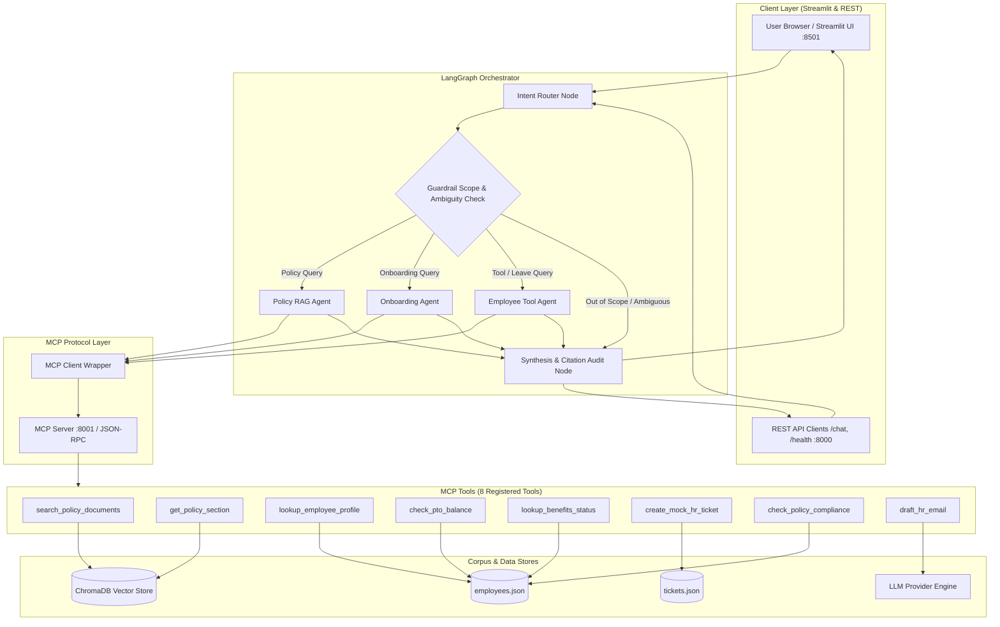

# GlobalTech HR Multi-Agent Automation System: Architecture & Design Documentation

## 1. System Overview & Architecture Diagram

The GlobalTech HR Multi-Agent System is an autonomous, production-grade enterprise assistant built using **LangGraph** and the **Model Context Protocol (MCP)**. It unifies semantic policy retrieval (RAG) with transactional employee workflows (PTO requests, onboarding roadmaps, equipment stipends, expense compliance) while enforcing strict action safety guardrails.

---

## 2. Design Choices & Technical Justifications

### 2.1 Agent Framework: LangGraph (`StateGraph`)
* **Choice:** LangGraph `StateGraph` over rigid chains or naive autonomous loops.
* **Justification:** LangGraph provides deterministic cyclical and conditional graph topologies with strong type safety (`HRAgentState`). It enables clear separation between **intent routing**, **pre-execution guardrails**, **specialized domain agents**, and **post-execution synthesis/citation auditing**.

### 2.2 MCP Server & Transport Architecture
* **Choice:** Model Context Protocol (MCP) server with **Streamable HTTP / JSON-RPC 2.0 transport** and an in-process local transport fallback.
* **Justification:** 
  - Meets requirement 5 by wrapping all tool invocations inside the formal MCP layer (`tools/list` and `tools/call`).
  - Supports both **distributed multi-service deployment** (MCP running as a standalone HTTP microservice on `:8001`) and **single-service container deployment** (running in-process or sidecar) without code changes.

### 2.3 Policy Ingestion, Parsing & Chunking Strategy
* **Choice:** Multi-format parser (`.md`, `.html`, `.txt`) with **Heading-Aware Semantic Chunking** (`HeadingAwareChunker`, max 250 words, 40-word overlap).
* **Justification:** 
  - Standard token-only chunking fractures policy sections (e.g., separating an equipment dollar limit from its eligibility conditions).
  - Heading-aware chunking respects markdown `##` sections and HTML `<section>` blocks, prepending document and section context `[Doc Title | Section Title]` to every chunk so individual chunks retain full semantic self-containment.

### 2.4 Vector Store & Embeddings
* **Choice:** **ChromaDB** with persistent on-disk storage (`chroma_db/`) and dual embedding modes (Chroma default `all-MiniLM-L6-v2` + deterministic normalized hash fallback).
* **Justification:** Zero-cost, lightweight local vector store requiring no cloud database fees. The deterministic fallback guarantees zero downtime and instant CI/CD test execution even in offline environments.

### 2.5 Action Safety & Guardrails
* **Choice:** Explicit user confirmation requirement (`confirmed=bool`) on all mutating operations (`create_mock_hr_ticket`).
* **Justification:** Irreversible or transactional HR actions (such as booking PTO or ordering hardware) must never execute spontaneously without explicit user assent. When unconfirmed, the tool returns `CONFIRMATION_REQUIRED`, prompting the user with an actionable confirmation dialog.

---

## 3. Required Agentic Demo Tasks & MCP Tool Sequences

### Demo Task 1: New Hire Onboarding Roadmap & Equipment Setup
* **User Query:** *"Help with onboarding checklist and draft welcome email for EMP-NEW-01"*
* **Expected MCP Tool Call Sequence:**
  1. `lookup_employee_profile(employee_id="EMP-NEW-01")`
     - *Purpose:* Retrieves Jordan Hayes' role (Associate Backend Engineer), department, and active onboarding checklist items.
  2. `search_policy_documents(query="new hire onboarding equipment allowance benefits 30 days enrollment", top_k=2)`
     - *Purpose:* Retrieves 30-day benefits enrollment deadline (`POL-BEN-2024`) and $750 home office equipment stipend rules (`POL-REMOTE-2024`).
  3. `draft_hr_email(recipient="Jordan Hayes", subject="Welcome to GlobalTech...", body_bullet_points=[...])`
     - *Purpose:* Formats a tailored welcome email summarizing pending onboarding milestones and equipment stipend instructions.

### Demo Task 2: PTO Balance Verification & Leave Request Guidance
* **User Query:** *"Check my PTO balance for EMP-101 and help me request 3 days off"*
* **Expected MCP Tool Call Sequence:**
  1. `lookup_employee_profile(employee_id="EMP-101")`
     - *Purpose:* Verifies Alice Chen's tenure (2.6 years), department (Engineering), and status.
  2. `check_pto_balance(employee_id="EMP-101")`
     - *Purpose:* Checks current balance (14.5 PTO days, 8.0 sick days) and Tier 2 accrual status.
  3. `check_policy_compliance(action_type="pto_request", details={"employee_id": "EMP-101", "days_requested": 3, "advance_notice_days": 14})`
     - *Purpose:* Validates requested days against policy notice rules (3-5 days requires 14 days advance notice).
  4. `search_policy_documents(query="PTO advance notice rollover rules", top_k=2)`
     - *Purpose:* Cites `POL-PTO-2024` for rollover caps and notice rules.
  5. `create_mock_hr_ticket(employee_id="EMP-101", ticket_type="PTO Request", details="Requesting 3 days PTO", confirmed=False)`
     - *Purpose:* Guardrail halts execution with status `CONFIRMATION_REQUIRED`, providing the user with a prompt to confirm before the mock ticket is recorded.
